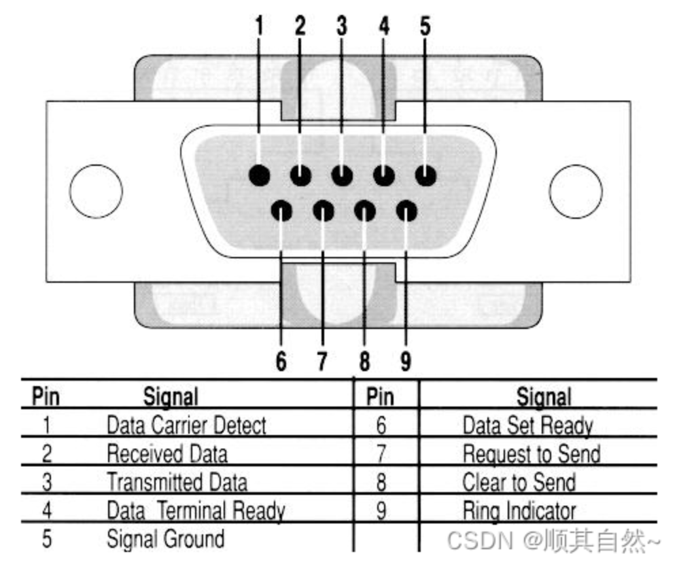
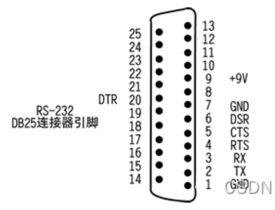

# 硬件接口

## 显示接口

### HDMI（High-Definition Multimedia Interface）

- 类型：数字视频和音频接口。
- 分辨率：支持高分辨率，包括4K和甚至更高的分辨率。
- 用途：HDMI广泛用于连接高清电视、显示器、投影仪、家庭影院系统、视频游戏机、蓝光播放器等设备。它是一种多功能接口，可以传输高质量的视频和音频信号。

### VGA（Video Graphics Array）

- 类型：模拟视频接口。
- 分辨率：通常支持较低的分辨率，最高可达到1920x1080像素。
- 用途：VGA接口在过去广泛用于连接计算机、显示器、投影仪和其他视频设备。然而，随着技术的进步，数字接口逐渐取代了VGA接口。

### DP（DisplayPort）

- 类型：数字视频接口。
- 分辨率：支持高分辨率，包括4K和以上的分辨率。
- 用途：DP是一种现代数字接口，用于连接计算机、显示器、电视和其他视频设备。它支持音频传输和高刷新率，并且是一种逐渐取代其他旧接口的标准。
  

总的来说，VGA是一种老式的模拟接口，而DP是一种现代数字接口。在新一代设备和显示器中，DP更常见，因为它提供更好的图像质量和更高的分辨率支持。
HDMI和DisplayPort在很多方面相似，但它们有一些不同之处，包括物理接口形状、支持的功能集、设备兼容性等。在消费电子设备中，HDMI更为普遍，而在计算机领域，DisplayPort也很常见。两者都是现代数字接口，提供高质量的音视频传输。

## USB接口
USB 3.1和USB 3.0都是通用串行总线（Universal Serial Bus）规范的版本，它们在数据传输速度和一些其他方面存在一些区别。

**数据传输速度**

- USB 3.0： 最初发布时，USB 3.0的最大理论传输速度为5 Gbps（千兆位每秒）。
- USB 3.1： USB 3.1提供更高的理论传输速度，分为两个版本：
- USB 3.1 Gen 1：与USB 3.0相同，最大传输速度为5 Gbps。
- USB 3.1 Gen 2：最大传输速度提高到10 Gbps。

**连接器类型**

- USB 3.0： 使用Type-A和Type-B连接器，其中Type-A连接器是常见的矩形形状。
- USB 3.1： 引入了新的连接器，包括Type-A、Type-B和Type-C。Type-C连接器是一种全新的反向插拔设计，更为方便。

**电源传输**

- USB 3.0： 提供有限的电源传输能力，用于充电设备。
- USB 3.1： 在USB Power Delivery规范的支持下，提供更高的电源传输能力，使其更适合充电大型设备如笔记本电脑。

总体而言，USB 3.1是USB 3.0的升级版本，提供了更高的传输速度和一些其他增强功能。在实际使用中，要确保设备和电缆都支持所需版本的USB规范，以充分发挥其性能。

## 串口
DB9是一种连接器标准，通常用于串口通信。DB9连接器具有9个引脚，其中包括传输数据、接地和其他控制信号的引脚。它是一种较为常见的串口连接器之一。

在DB9连接器中，常见的引脚分配通常包括：

- 数据传输引脚（TX、RX）： 用于发送和接收数据。
- 地线引脚（GND）： 用于提供电气接地。
- 控制信号引脚（如RTS、CTS、DTR、DSR）： 用于控制和监控数据流。
- 
DB9连接器最常见于RS-232串口标准，但它也可用于其他串口标准，如RS-422和RS-485，这是一种点对点的串口通信标准，通常用于连接计算机与外围设备，如调制解调器、打印机、条码扫描器等。

RS-232、RS-422和RS-485是一些常见的串口通信标准：

### RS-232
9针D型连接器（DB9）

DB25

是一种单端口、点对点的通信标准。 
通常用于短距离通信，最常见于计算机与外围设备（如调制解调器、打印机）之间的连接。

### RS-422
是一种差分信号的通信标准，支持多点通信。 
适用于中长距离通信，具有抗干扰能力。

### RS-485
也是一种差分信号的通信标准，支持多点通信。 
类似于RS-422，但RS-485支持更多节点，且更适合工业环境。

隔离在这里指的是串口之间具有电气隔离。这意味着每个串口之间都有独立的电气电路，防止其中一个串口的电气问题传播到其他串口。这种隔离设计可以提高系统的稳定性和抗干扰性，尤其是在工业环境中，其中可能存在电气噪声和干扰。

## PLC接口
PLC是一种用于自动化控制系统的设备，通常包括多种接口以连接和交互不同类型的设备。具体的接口类型和数量可能因制造商、型号以及应用需求而有所不同。然而，以下是一些常见的接口类型，通常包含在PLC中：

- 数字输入接口： 用于连接数字输入信号，例如传感器、开关、按钮等，以监测外部事件或状态。

- 数字输出接口： 用于连接数字输出设备，例如继电器、电机驱动器等，以执行控制系统中的操作。

- 模拟输入接口： 用于连接模拟传感器，例如温度传感器、压力传感器等，以监测模拟信号。

- 模拟输出接口： 用于连接模拟输出设备，例如调节阀、变频器等，以执行需要模拟信号的操作。

- 以太网接口： 用于连接PLC到以太网网络，以实现远程监控、数据通信和集成到上层网络系统。

- 串口接口： 用于连接PLC到其他设备，如人机界面（HMI）、计算机、打印机等，通常支持标准的串行通信协议。

- USB接口： 用于连接外部设备，例如存储设备、编程设备，以便进行PLC程序的加载和升级。

- CAN接口： 用于连接CAN（Controller Area Network）总线，以实现在工业控制系统中与其他设备通信。

- Profibus或其他现场总线接口： 用于连接PLC到现场总线，通常用于与其他自动化设备进行通信。

- 电源接口： 用于连接电源，提供PLC所需的电力。