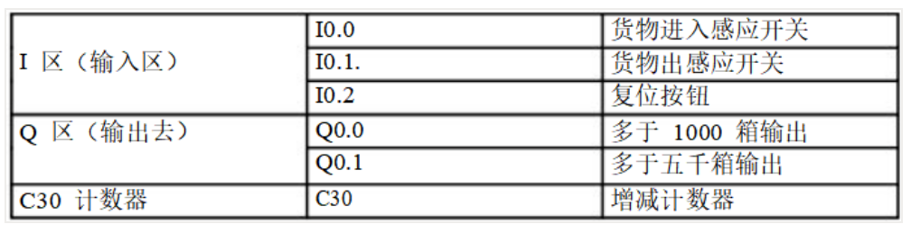
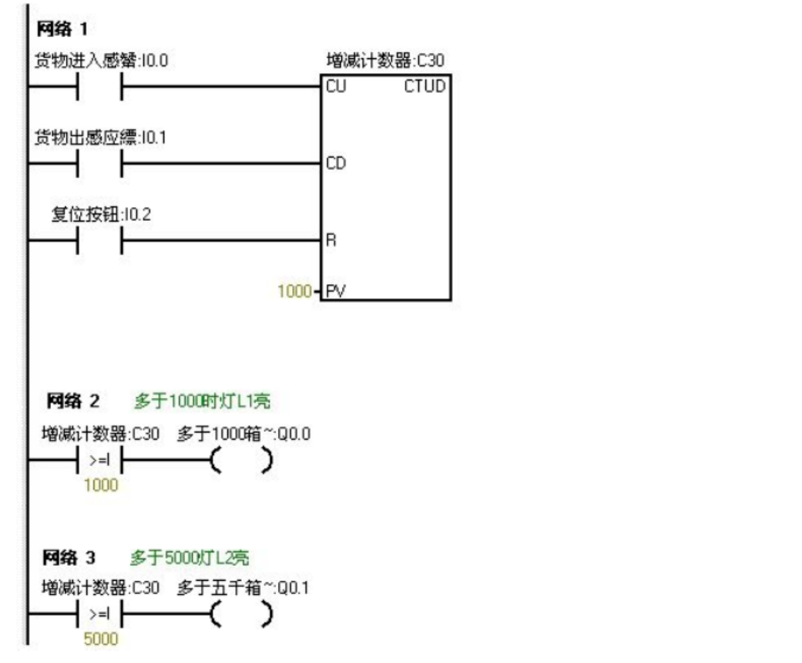

# 梯形图示例1

## 仓库货物记录
对进出仓库的货物进行记录。仓库最多可放6000箱货物，货物多于1000箱灯L1亮，多于 5000箱时灯L2亮。

## I/O变量分配表

## 梯形图程序

## 结果分析
我们把L1的灯亮的时候设置为5。把L2灯亮我们设置为10。

当按下在线控制面板上的I0.0f的时候即I0.0接通，表示有货物进去。当我们点击在线控制面板上的I0.0f五次后，此时计时器中的计数值为5，（即表示仓库中已经有1000箱物品了）则灯L1要亮，即Q0.0有输出。

当继续点击I0.0f后点 击有十次后此时计数器的计数值位10（即表示仓库中有5000个物品），此时灯L2也亮即Q0.1有输出当继续点击在线控制面板上的I0.0f。计数器中的计数值就继续往上增加。

当按下在线控制面板上的I0.1f后计数器就开始往下减。

点击一次，计数器中的计数值就减少一次。

当计数器中的值小于10时即表示仓库中的物品少有5000箱，此时灯L2灭（即Q0.1没有输出）当继续点击I0.1f时计数器 中的计数值继续减少，当减少到小于5次时。

表示仓库中的物品少于1000，此时灯L1灭。Q0.0就没有输出。

当按下在线控制面板上的I0.2f时计数器清零。L1和L2都不亮，（即Q0.和Q0.1都没有输出）。